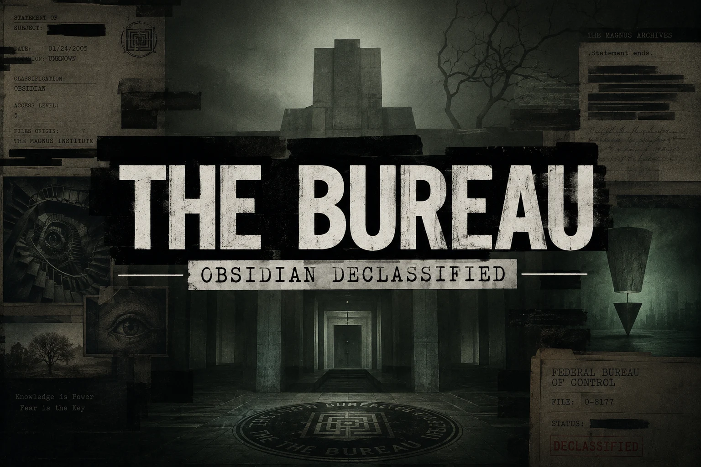
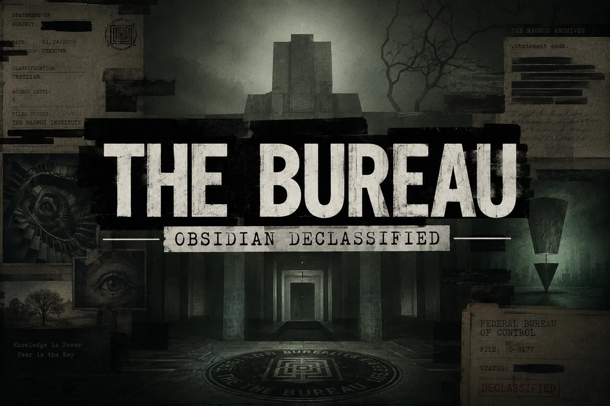
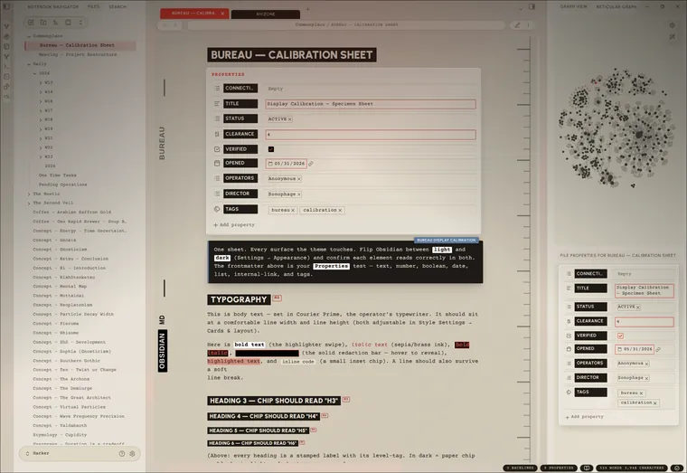
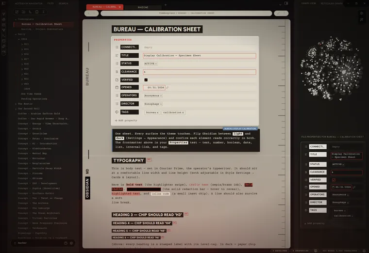
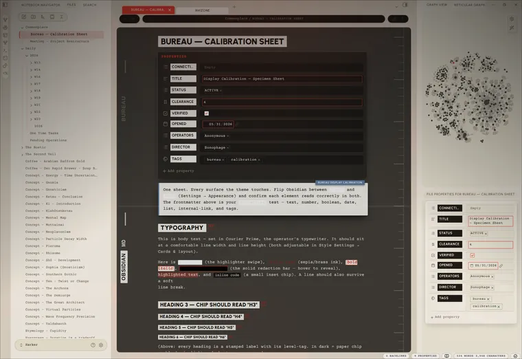

# Bureau

A noir theme for [Obsidian](https://obsidian.md). A worn case-file on a concrete
desk, wired to a CRT that hums whether or not you're listening.

> [!IMPORTANT]
> Most of Bureau lives in the [Style Settings](https://github.com/mgmeyers/obsidian-style-settings) plugin. Install it and you get a single **Bureau** panel (Settings → Style Settings → Bureau) with every option in one place. The theme runs fine without it — just on its built-in defaults.

I've always liked that redacted-bureau look. The brutalism of it: heavy type that doesn't apologise, stamped labels, lines blacked out by someone who decided you didn't need to read them. Documents with purpose, and what is Obsidian for most of us if not a collection of notes and documents that serve a purpose? A lot of themes are a pile of effects in a trench coat — gorgeous in the screenshot, unlivable by the second week. Pretty to look at but hard to work in. I themed hopped for months and never really felt at home. Like I was using someone elses desk. Settings that were cool but didnt work right or made editing difficult. Then there were things that some themes just could not do. I didn't want effects. I wanted a room you could sit in at 2 AM and feel like the work mattered. One cohesive place I could spend hours in.

The mood comes from three places, and each one is an accent you pick — the single colour the whole UI, the glow, and every highlight read from, the way a room reads from one bad bulb:

- **Control** — the institutional dread of the Federal Bureau of Control, the red of a door you shouldn't open. The default **red** accent.
- **Magnus** — *The Magnus Archives*: dust, quiet wrongness, a tape still running. The **green** accent.
- **Deus** — *Deus Ex*: black-and-gold cyber-renaissance, conspiracy with good lighting. The **gold** accent.

Most themes pick a side and defend it like an identity, Dark only, or if your lucky Dark and Light versions. But even the light versions are too bright and the dark versions are too dark. Bureau runs both; a near-black **noir** and a daylight **case-file in paper**. The interesting part is the ground between them. 

Set the editor to the *opposite* palette of its chrome and you get a lit page on a dark desk, or a dark page in a lit room. The picture lives in that seam where light meets dark. 

Everything textural is procedural SVG, drawn by the stylesheet instead of
photographed and dragged in (mostly for sharpness and responsiveness). There's a CRT layer if you want it: scanlines, phosphor glow, a white line that scans down the page and glitches like a loose wire, a power-on that fades up from black each time you open a note. None of it is load-bearing — leave it off and the theme still stands. Turn it on when you want the machine to feel haunted. On a phone it quiets all of that down on its own.

## Showcase

<table>
  <tr>
    <td align="center"> White — daylight</td>
    <td align="center"> Black &amp; White</td>
    <td align="center"> White &amp; Black</td>
  </tr>
</table>

## Install

**Community themes:** Settings → Appearance → Manage → search **Bureau**.

**Manual:**
1. Download `theme.css` and `manifest.json`.
2. Drop them into `<vault>/.obsidian/themes/Bureau/`.
3. Settings → Appearance → Themes → **Bureau**.

> **Install the [Style Settings](https://github.com/mgmeyers/obsidian-style-settings) plugin.** Everything below lives there, in one **Bureau** panel. Without it the theme still runs — it just runs the way the house came: someone else's defaults.

> **Light or dark** is Obsidian's own switch (Settings → Appearance), not the theme's. Bureau dresses both: a full **daylight** variant — aged paper, a black marginalia ledger, dark ink — sits behind light mode the same way the noir sits behind dark. The theme can't throw Obsidian's switch for you.

## The panel

Everything is in **Settings → Style Settings → Bureau**. The panel remembers what
you told it — switching presets never paves over your choices. What follows walks
the panel top to bottom, in the order you'll find it.

### Mode

One dial that decides how haunted the room gets, layered over everything else.

| Mode | What you get |
| --- | --- |
| **Low** | The bones. Styling only — no texture, no glow, no CRT, no motion. |
| **Medium** | Texture and the ambient glow. Lived-in. No CRT, no animation. |
| **High** | Everything awake. The machine knows you're here. |
| **Custom** | Your own arrangement — every toggle below, exactly as you left it. |

Low and Medium *override* the individual toggles while they're active; your
toggles are never lost — switch to **Custom** and they come back.

### Color & accent

- **Inverted editor** — the chiaroscuro switch: the editor pane takes the *opposite* palette to the rest of the UI. Caret, texture and ink all flip with it. (Flip Obsidian's own light/dark to swap which side is which.)
- **Per-mode palette** — for finer control than the single switch above, set the **sidebars** and the **editor** to light or dark *independently*, and lock each in per Obsidian appearance. Four selectors (sidebars + editor, for light mode and dark mode), all defaulting to follow the appearance — so e.g. light mode can run a paper editor on dark sidebars while dark mode stays dark-on-dark, and your light/dark hotkey flips between exactly what you set for each.
- **Accent preset** — *Control* (red) · *Magnus* (green) · *Deus* (gold) · *Custom*, plus a **Custom accent** colour when you want your own.
- **Phosphor terminal** — collapse the body text to the accent, like a single-phosphor tube. (A dark accent recolours *all* body text — that's the trade.)
- **Native accent** — Bureau doesn't force Obsidian's built-in accent, so the startup colour follows **Settings → Appearance → Accent color**. Match it to your Bureau accent for a seamless launch (the startup screen paints before Style Settings loads).
- **Text colour** (per mode) and **Black / White level** — set the ink, and how far the darkest surface and the brightest paper go.

### Atmosphere

The ambient layer — all sliders, 0 = off, so it's there only as much as you want.

- **Glow intensity / reach** — accent light bleeding up from the bottom of the window.
- **Film grain** — fine grain over everything; proof the image was developed, not generated.
- **Shadow strength** — the master depth of every cast shadow in the theme.
- **Sidebar texture** — concrete grain on the panels behind the cards.
- **Vignette** — the edges darkened, the way attention darkens at the edges.
- **Accent halo** — a soft accent ring that breathes outward behind the UI (stills to a faint ring under reduced-motion).

### CRT

The tube. Optional, and quietly the whole point.

- **CRT scanlines** (strength + spacing) — faint horizontal lines over the editor.
- **CRT text glow** — phosphor bloom on the body text.
- **Fullscreen CRT mode** — go fullscreen and the screen curves: tube vignette, scanlines and glow up, chrome receding into the dark until you reach for it.
- **Focus line** — every line dims except the one you're on, which gets an accent mark in the margin.

### Cards & layout

- **Cards layout** — every pane floats as a bordered card on a dark desk. Paper on concrete. The cards carry a faint glass bevel (lit top-left, shaded bottom-right) so they read as slabs, not stickers.
- **Card gap / rounding / shadow** (darkness · blur · spread) — how far apart, how soft the corners, how deep the shadow.
- **Reading line width / line height / paragraph spacing** — the density dials.
- **Horizontal settings nav** — reflow the settings window's tab list into a strip across the top (desktop only).
- **Print — show link URLs** — print internal/external links with their target spelled out.

### Floating & glass

Optional soft looks over the brutalist base — all off by default.

- **Heavier card float** — a deeper shadow and more space, so panes lift higher off the desk.
- **Frosted glass panes** — translucent, blurred editor and sidebars; the stage (or your wallpaper) shows through.
- **Flat card edges** — drop the bevel for a flat, matte card.
- **Pill terminal (floating editor)** — the full Ultra-Lobster move: the header breaks into flat pills, the title bar goes transparent, and the editor floats as its own rounded card below the chrome (the status bar splits into pills too). Best with Cards layout on. **Desktop only — it auto-suppresses on phones and tablets**, where the floating card breaks layout.
- **↳ Pill terminal — hover to reveal** — the header pills collapse until you hover or focus the row, reclaiming the space.
- **Editor-only cards** — only the editor floats as a card; the sidebars sit flush.

### Pill editor card

Fine-tuning for the floating card in *Pill terminal* mode (needs Pill terminal on):
**remove or recolour its border**, set its **rounding** (drives the clip-path, so
corners clip cleanly), and nudge the **stacked-tabs spine inset** to line the tab
spine up with the card.

### Background

A wallpaper behind the workspace, visible through the frosted glass, plus the
empty New-Tab pane's artwork.

One thing to know up front: **pure CSS can't point at a vault file by path.**
Obsidian serves vault files over a per-install `app://<token>/…` URL that only
JavaScript can mint; the old `app://local/…` shortcut no longer resolves, and
relative paths don't resolve inside an injected stylesheet. So a *web* image can
be linked directly, but a *local* image has to be embedded or fed in by a plugin.
Three ways:

- **Web image** — paste a full `url('https://…')` into **Background image — web URL**. Layers on top, so a web URL always wins. (Re-fetched every launch.)
- **Local, point-and-click** *(easiest)* — install the optional [**Redacted Background**](https://github.com/Sonophage/Redacted-Background) companion plugin (via [BRAT](https://github.com/TfTHacker/obsidian42-brat)), then right-click any vault image → **Set as Redacted Background**. It feeds Bureau a live resource path — no encoding step — and sets the new-tab image too.
- **Local, no plugin** — turn the image into a base64 data URI (any "image to base64" tool, or `magick img.png -quality 82 -strip /tmp/bw.jpg && base64 -w0 /tmp/bw.jpg`) and paste the whole `url('data:image/jpeg;base64,…')` into the same web-URL field.

**New-tab image** paints the empty New-Tab pane: **Bureau image** (the packaged
artwork, shown by default, embedded as base64 webp in `theme.css`), **Off**, or
**Custom URL** — with a size slider. The 3-way select + data-URI delivery is
adapted from the [Border theme by Akifyss](https://github.com/Akifyss/Border); the
artwork is original. To swap it, replace `new-tab.webp` and re-embed it as
`--bu-new-tab-default-image` (`printf 'url("data:image/webp;base64,%s")' "$(base64 -w0 new-tab.webp)"`).

> **Why the plugin isn't bundled:** Obsidian distributes a theme as **only** `theme.css` + `manifest.json` — it can't ship or install a plugin for you. So [Redacted Background](https://github.com/Sonophage/Redacted-Background) lives in its own repo, installed via BRAT.

### Tabs

- **Tab shape** — *Folder* (connected, like a real file drawer) or *Pill* (fully rounded). The active tab fills solid accent and rises taller; inactive tabs invert (black-on-white / white-on-black) and are **editor-aware**, flipping with *Inverted editor* so they track the editor's palette. Labels sit dead-centre and stay put when the close button appears.
- **Main / Left / Right tab content** — Icons · Labels · Icons + Labels, per dock.
- **Pinned tabs → icon only** — the ones you've decided to keep say less.

### Hide / Focus

For when the room has too much furniture.

- **Focus Mode** — kills the tab bar, window buttons, and status bar in one move. Bind a hotkey to *Style Settings → Toggle Focus Mode* to clear the desk without looking down.
- À-la-carte, hide any of: **status bar**, **breadcrumbs**, **tab close button**, **left/right sidebar toggles**, **folder collapse arrow**, **command-palette instructions**.

### Animation

Restrained, CRT-flavoured, eased — never bouncy. A master **Animations** toggle
gates all of it, with a **speed** slider and an **easing** select; **Respect
"reduce motion"** hands control back to the OS setting.

The headline pieces: **CRT power-on** (content fades up from black on open),
**Boot sequence** (a CRT switch-on flash on app launch), **Channel-change
crossfade** (fade + scan-line wipe on note switch), the **Scanning line** (a faint
line that drifts down the editor and glitches, with brightness / interval / depth
sliders), and **Limelight** (spotlight the active pane; everything else dims until
you look at it). Past those sit the small tics — terminal block caret, active-line
scan, CRT flicker, eased checkbox tick, typewriter tooltips, breathing glow,
faded menus — the wobble in the fan.

### Resize handles

The divider lines between sidebars and editor: **remove** them for a seamless
edge, or set a **custom colour**. (*Remove* wins if both are on.)

### Scrollbars

**Hide** them (content still scrolls), set the **width**, **fade** them in on
hover (with a delay), **accent the thumb** while scrolling, or give the resting
thumb and its **grip** their own custom colours.

### Daily notes

One **accent per weekday** (Sun–Sat) — so Tuesday doesn't get to look like Friday
— with text and background derived from that accent automatically, light *and*
dark. Add the weekday class (e.g. `cssclass: monday`) to key a note's palette. If
you ran the old "Daily Note Themes" snippet, switch it off — Bureau owns this room
now.

### Changelog (in-panel)

The foot of the panel carries a live **What's new** note and the full **Release
history**, regenerated on every release so the app always shows the same changelog
as this repo.

## On mobile

The theatre dims itself on phones and tablets, automatically — no toggle, no Style
Settings required. Grain, scanlines, glow, motion and the heavy card shadows drop;
tap targets grow; and the **Pill terminal / floating editor auto-suppresses** even
if you left it on for desktop, because the floating card and pill header don't
survive a small screen. The device that can't afford the show doesn't have to sit
through it.

## Changelog

The full history lives on the [releases page](https://github.com/Sonophage/Bureau/releases),
and inside the app at the foot of the **Bureau** Style Settings panel (*Release
history*). When cutting a new release, add its `### X.Y.Z` entry **below this
paragraph**, newest first — `release.py` reads it from here (see [Releasing](#releasing)).

### 2.14.0
- **File explorer: the case-file registry look.** A new *File explorer* section adds two toggles that turn the file tree into the Bureau index. *Registry list* rules every entry as a ledger row, stamps folders as accent uppercase section bands, and recolours the indent guides to an accent ledger line; *Active file as inverted bar* renders the open note as a solid inverted stamp (light fill, dark ink, the redaction mark flipped) with an accent registry dot, auto-inverting per appearance. Obsidian indents nested rows with inline `!important` styles a theme can't override, so the bands and rules are painted as `background-clip: content-box` layers instead of borders plus fills: that way they begin at each row's own indent and subfolders visibly step in, with no depth-counting. A reduced-motion-safe hover wash, plus an accent ink for hovering the active bar, make the register feel tactile. Both toggles default off.
- **Block caret width, plus a native-caret fallback.** The terminal block caret gains a width slider (*↳ Block caret width*), from the original sliver to a full character cell. And where Obsidian draws the OS-native caret, which the drawn-cursor styling can't reach, a `caret-shape: block` rule now blocks that too; it's inert on engines without `caret-shape` support, so it simply activates once the runtime ships it.
- **Vim mode caret.** A new *Vim mode caret + mark* toggle pulls Obsidian's Vim block cursor and its stock-green visual-mode mark onto the Bureau accent, so normal- and visual-mode read in palette instead of the default green. Opt-in, and only visible with Vim keybindings enabled.

### 2.13.0
- **Command palette & Omnisearch now read over anything.** The floating palette/search was built to sit on the dark editor, so over a bright surface (a Surfing web view, a console pane) the page bled straight through and the results turned to mush, worst in light mode. Two fixes: the backdrop scrim is stronger (a `backdrop-filter` blur cannot reach into a web view's own compositing layer, so the solid dim has to carry it), and in dark mode the input and results now sit on their own frosted card, matching the paper cards light mode already had, so the text always has a surface under it. Omnisearch's Vault Search builds its own input box, which never picked up the palette's card or ink; it now gets both, fixing the washed-out search field.
- **Menus, autocomplete and hover previews less sheer.** The shared surface behind menus, suggestion dropdowns (including the property-value autocomplete you type into) and hover popovers went from 72% to 90% opaque, so their text stops fighting whatever sits behind them.
- **Surfing input fields legible in both modes.** The Surfing plugin styles its address bar, new-tab search and in-page find box with only `box-shadow: unset`: no colour, no fill, so the text inherited a value that went white-on-white on paper and dark-on-dark at night. They now take an explicit Bureau field fill and ink, with a focus accent.

### 2.11.1
- **True-case headings and titles in the editor** — the editor (Live Preview / source) no longer force-uppercases heading text or the inline note title, so what you type shows in the casing you typed and is easy to edit. Reading view is unchanged: headings and the title still render as the full uppercase Bureau stamp.

### 2.10.0
- **Mobile sidebar no longer renders blank until tapped** — on phones, opening or switching a side-drawer view (file explorer, Notebook Navigator, search) left it blank until you tapped it once. The cause was the mobile baseline's blanket `body.is-mobile * { animation: none }`: alongside Bureau's decorative animations it also killed the zero-duration CSS animations Obsidian's list views use as a render hook, so the lists never got told to paint. The blanket rule is gone; Bureau's own animations are now held off mobile at the source (every `bu-anim` rule is gated `:not(.is-mobile)`), so a phone still shows no Bureau animation while Obsidian's hooks keep working.
- **Per-mode palette (independent sidebars + editor)** — the sidebars/chrome and the editor pane can now be set to light or dark *independently*, locked in per Obsidian appearance, via four new Style Settings selectors under *Color & accent* (sidebars + editor, for light mode and dark mode). All four default to following the appearance, so existing setups are untouched; the global *Inverted editor* toggle is unchanged. The selectors are fully orthogonal — your editor choice always wins over a sidebar flip — so a paper editor on dark sidebars in light mode (with dark-on-dark in dark mode) is now a clean two-click setup that your light/dark hotkey flips between.
- **Base-hue tint** — a per-appearance **Base hue** + **Base tint strength** pair (under the new Dark mode / Light mode sections) re-tints the whole base palette — backgrounds, surfaces, borders, text — in oklch, so the colour stays visible even on the near-black surfaces. Defaults are no-ops (the stock warm look); the accent is untouched.
- **Callout title pill no longer cropped in Live Preview** — the floating callout TITLE pill (which sits above the callout's top edge) was getting clipped by the editor's collapsed top margin in Live Preview; restored the top margin so it shows whole, as it already did in reading view.

### 2.9.3
- **New README hero** — the README now leads with the Bureau wallpaper artwork (full 1536×1024, served as a 264 KB webp) in place of the small store screenshot. Docs/asset only — no theme changes.

## Credits

Bureau picked these pockets, gratefully:

- **[blobob](https://github.com/kazi-aidah/blobob)** — the hide/focus options, the animation principles, the way the tabs are handled.
- **[Daily Note Themes](https://github.com/CyanVoxel/Obsidian-Daily-Themes)** (CyanVoxel) — the per-weekday colour-scheme idea, lifted wholesale and grateful for it.
- **[Elysian](https://github.com/matothetomato/elysian)** — styling it taught me by example.
- **[Minimalist Paradise](https://github.com/bellebasso/Minimalists-Paradise)** — same debt, different teacher.
- **[Limelight](https://github.com/smikula/obsidian-limelight)** (smikula) — the spotlight-the-active-pane idea, rebuilt here in pure CSS.
- **[Ultra-Lobster](https://github.com/7368697661/Ultra-Lobster)** (7368697661) — the floating-card glass UI: frosted panes, a custom wallpaper behind them, and pill chrome.
- **[Border](https://github.com/Akifyss/Border)** (Akifyss) — the new-tab image select and its data-URI delivery.

Fonts, embedded in the stylesheet as woff2 (latin + latin-ext) so they load
instantly and offline, with system fallbacks: **Urbanist** (the labels, the
stamps) and **Courier Prime** (the body, the mono). Both OFL.

## Development

Pulling the lid off, filing a bug, or sending a change? [CONTRIBUTING.md](CONTRIBUTING.md)
has the house rules — one file, no `!important`, no `:has()`, opt-in atmosphere —
and the `@settings` scars worth not reopening.

It's one `theme.css`. Edit it and reload Obsidian — hard-reload, or toggle the
theme off and back on, because Obsidian caches the stylesheet and will lie to you
about whether your change took. Retheme from the `.theme-dark` token block at the
top, where the whole palette lives in one place. The Style Settings config is the
`@settings` block at the foot — it looks like a comment and it is not; leave it
alone unless you mean it.

### Releasing

To cut a release: add the new `### X.Y.Z` entry to the [Changelog](#changelog)
(newest first, below the pointer paragraph), then run `./release.py X.Y.Z`. The
script stamps `manifest.json` and the `theme.css` header, regenerates the in-panel
*What's new* note and prepends the entry to *Release history*, validates the CSS
(braces + the `@settings` YAML), then commits, tags, pushes `main` + the tag, and
publishes the GitHub release with `theme.css` + `manifest.json` attached. Use
`--dry-run` to preview without touching a thing, `--yes` to skip the confirmation.
Tags carry **no `v` prefix** (Obsidian matches them to the manifest).

## License

MIT. Take it apart. Build your own room.
