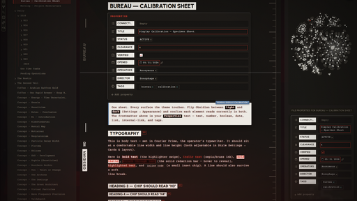

# Bureau

A noir theme for [Obsidian](https://obsidian.md). A worn case-file on a concrete
desk, wired to a CRT terminal that hums whether or not you're listening.

I've always been fond of the *bureau-redacted* look. The noiresque of it, the
brutalism: heavy type that doesn't apologize, stamped labels, lines blacked out
by someone who decided you didn't need them, concrete and steel that were never
trying to be warm. Most themes are a pile of effects in a trench coat —
beautiful in the screenshot, incoherent the moment you live in them. I didn't
want effects. I wanted a room. One you could sit inside at 2 AM and feel like
the work mattered and the building was on your side, even if the building was
indifferent. Bureau is that attempt. It performs *home* the way a rental
performs it: clean, lit, holding its breath, hoping you don't look too closely
at the ceiling fan.

Its mood was stolen, in equal parts, from three places:

- **Control** — the institutional dread of the Federal Bureau of Control, the red of a door you shouldn't open (the default **red** accent).
- **The Magnus Archives** — dust, quiet wrongness, a tape still running (the **green** accent, *Magnus*).
- **Deus Ex** — black-and-gold cyber-renaissance, conspiracy with good lighting (the **gold** accent, *Deus*).

It used to be dark only — and that was the whole creed. It isn't anymore, and the
change turned out to *be* the point. Most themes pick a side: all-dark or
all-light, and they defend it like an identity. Bureau runs both — a near-black
**noir**, and a daylight **case-file in paper** — but the real room is the ground
between them. You can run the editor in the *opposite* palette to its chrome: a
lit page on a dark desk, or a dark page in a lit room. That isn't indecision.
It's **chiaroscuro** — the picture lives in the seam where light meets dark, not
in either alone. A compromise, and a deliberate one: light *and* dark, noir *and*
its negative, held in the same frame.

Every texture is procedural SVG, drawn by the stylesheet, not photographed and
dragged in. The whole UI reads from a single accent colour, the way a room reads
from a single bad bulb. And there's a CRT layer — scanlines, phosphor glow, a
white line that scans down the page and glitches like a loose wire, a power-on
that fades up from black every time you open a note. None of it is load-bearing.
All of it is there if you want the machine to feel haunted. And on a phone it
quiets itself down without being asked.

## Install

The straight way, no ceremony:

**Community themes:** Settings → Appearance → Manage → search **Bureau**.

**Manual:**
1. Download `theme.css` and `manifest.json`.
2. Drop them into `<vault>/.obsidian/themes/Bureau/`.
3. Settings → Appearance → Themes → **Bureau**.

> **Install the [Style Settings](https://github.com/mgmeyers/obsidian-style-settings) plugin.**
> Everything below lives there, in one **Bureau** panel. Without it the theme
> still runs, but it runs the way the house came — someone else's defaults, the
> thermostat set to a temperature that isn't yours.

## Controls

All of it is in **Settings → Style Settings → Bureau**. The panel remembers what
you told it; switching presets never paves over your choices. It keeps your
fingerprints.

### Mode

The blunt instrument. One dial that decides how haunted the room gets, layered
over everything else:

| Mode | What you get |
| --- | --- |
| **Low** | The bones. Styling only — no texture, no glow, no CRT, no motion. The lights are on and nothing is breathing. |
| **Medium** | Texture and the ambient glow. The room is lived-in. No CRT, no animation. |
| **High** | Everything awake. The machine knows you're here. |
| **Custom** | Your own arrangement — every toggle below, exactly as you left it. |

And the **Inverted editor** toggle — the chiaroscuro switch. Turn it on and the
editor pane takes the *opposite* palette to the rest of the UI: in dark mode, a
paper page on a dark desk; in light mode, a dark page in a lit room. The caret,
the texture, the ink all flip with it. Flip Obsidian's own light/dark appearance
to swap which side is which — that dial is Obsidian's, not the theme's, so the
theme can't throw it for you.

> **Light or dark** is Obsidian's own switch (Settings → Appearance). Bureau
> dresses both: a full **daylight** variant — aged paper, a black marginalia
> ledger, dark ink — sits behind the light mode, the same way the noir sits
> behind the dark.

### Color & accent
- **Accent preset** — *Control* (red) · *Magnus* (green) · *Deus* (gold) · *Custom*. The single colour the whole UI, the glow, and every highlight read from. Change it and the building changes allegiance.
- **Custom accent** — your own colour, used when the preset is *Custom*. Bring your own bad bulb.

### Atmosphere
- **Glow intensity / reach** — the accent light bleeding up from the bottom of the window, like something is on fire one floor down.
- **Film grain** (+ intensity) — fine grain over everything. Proof the image was developed, not generated.
- **Sidebar texture** (+ strength) — concrete grain on the panels behind the cards. The walls the cards are pinned to.
- **Vignette** (+ amount) — the edges of the window darkened, the way attention darkens at the edges.

### CRT
The tube. Optional, and quietly the whole point.
- **CRT scanlines** (strength + spacing, 0 = off) — faint horizontal lines laid over the editor, the ghost of a screen that was never really there.
- **CRT text glow** (brightness, 0 = off) — phosphor bloom on the body text. The letters sweat a little.
- **Fullscreen CRT mode** — go fullscreen and the screen curves: a tube vignette, scanlines and glow turned up, and all the chrome receding into the dark until you reach for it.
- **Focus line** (+ dim amount) — every line dims except the one you're on, which gets an accent mark in the margin. The rest of the page waits in the next room.

### Cards & layout
- **Cards layout** — every pane floats as a bordered card on a dark desk. Paper on concrete.
- **Card gap / rounding / shadow darkness** — how far apart, how soft the corners, how deep the shadow they cast.

### Tabs
- **Tab shape** — *Folder* (connected, like a real file drawer) or *Pill* (fully rounded, for people who've made peace with it).
- **Main / Left sidebar / Right sidebar tab content** — Icons · Labels · Icons + Labels. Decide per dock how much each tab is willing to admit about itself.
- **Pinned tabs → icon only** — the ones you've decided to keep say less.

### Hide / Focus
For when the room has too much furniture.
- **Focus Mode** — kills the tab bar, the window buttons, and the status bar in one move. Bind a hotkey to *Style Settings → Toggle Focus Mode* and you can clear the desk without looking down.
- À-la-carte, hide any of: the **status bar**, **breadcrumbs**, **tab close button**, **left/right sidebar toggles**, **folder collapse arrow**, **command-palette instructions**. Each one a thing you decided you didn't need to see again.

### Animation
Restrained, CRT-flavoured, eased — never bouncy. Nothing here springs at you; it
arrives, the way weather arrives. A master **Animations** toggle gates all of it,
with a **speed** slider (400–1000 ms; hover and state changes run snappier than
entrances).

- **CRT power-on** — content fades up from black when a note or pane opens. The tube warming.
- **Channel-change crossfade** — fade-from-black plus a scan-line wipe when you switch notes. Changing the channel.
- **Boot scan-sweep** — one bright line wipes down the screen at launch, then it's gone.
- **Scanning line** — a faint white line drifts slowly down the editor and, every so often, glitches in and out like a connection that isn't seated right. Sliders for **brightness**, **glitch interval**, and **glitch depth** — how visible, how often, how bad.
- **Breathe the ambient glow**, **ease the phosphor glow**, **fade menus & modals** — the slow involuntary motions of a machine that's idling, not dead.
- **Terminal block caret**, **hover bloom** (accent glow under the cursor), **active-line scan**, **CRT flicker**, **CRT loading throbber**, **eased checkbox tick** — the small tics. The wobble in the fan.
- On **mobile**, the theatre dims itself: grain, scanlines, glow, motion, and the heavy shadows drop automatically on phones and tablets — no toggle, no Style Settings required — and tap targets grow. The device that can't afford the show doesn't have to sit through it.

### Daily notes
A colour scheme per weekday (Sun–Sat), each with its own **accent**, **text**,
and **background** — so Tuesday doesn't get to look like Friday. Add
`cssclass: daily` (or a specific weekday class) to a note to key its palette. If
you ran the old "Daily Note Themes" snippet, switch it off — Bureau owns this
room now.

## Credits

Bureau picked these pockets, gratefully:

- **[blobob](https://github.com/kazi-aidah/blobob)** — the hide/focus options, the animation principles, the way the tabs are handled.
- **[Daily Note Themes](https://github.com/CyanVoxel/Obsidian-Daily-Themes)** (CyanVoxel) — the per-weekday colour-scheme idea, lifted wholesale and grateful for it.
- **[Elysian](https://github.com/matothetomato/elysian)** — styling it taught me by example.
- **[Minimalist Paradise](https://github.com/bellebasso/Minimalists-Paradise)** — same debt, different teacher.

Fonts, loaded via Google Fonts with system fallbacks when the wire goes dead:
**Urbanist** (the labels, the stamps) and **Courier Prime** (the body, the
mono). Both OFL.

## Development

It's one `theme.css`. Edit it and reload Obsidian — hard-reload, or toggle the
theme off and back on, because Obsidian caches the stylesheet and will lie to you
about whether your change took. Retheme from the `.theme-dark` token block at the
top, where the whole palette lives in one place. The Style Settings config is the
`@settings` block at the foot — it looks like a comment and it is not; leave it
alone unless you mean it.

## License

MIT. Take it apart. Build your own room.
